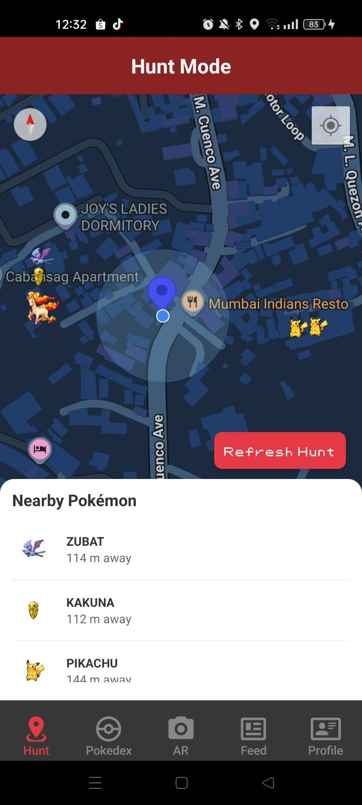
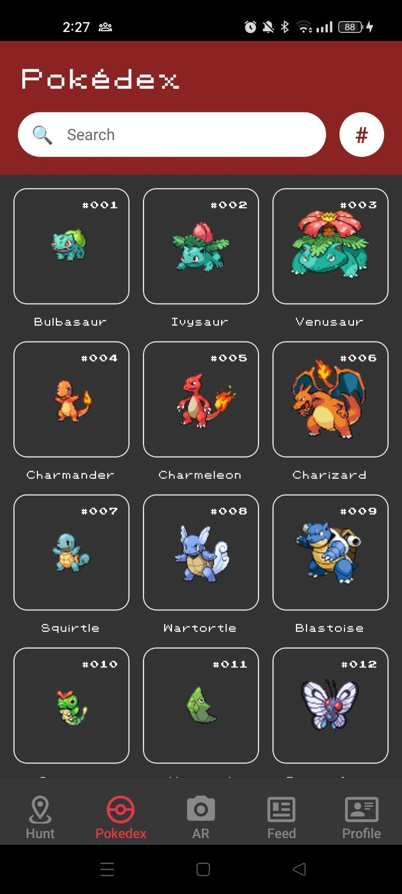
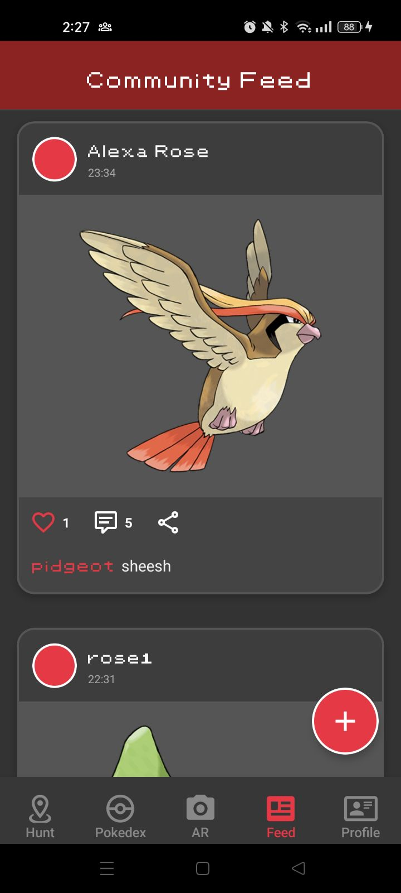

# 🔴 PokeExplorer

  A location-based Social Pokédex app built for Trainers.

 

## 📸 Gallery

  <table>
    <tr>
      <td align="center"><b>📍 Hunt Mode</b></td>
      <td align="center"><b>📖 Pokédex</b></td>
      <td align="center"><b>🌍 Community Feed</b></td>
    </tr>
    <tr>
      <td></td>
      <td></td>
      <td></td>
    </tr>
  </table>

---

## 📱 Features

### 🔍 Pokédex
*The ultimate encyclopedia.*
* **Live Data:** Fetches continuously updated data from PokeAPI.
* **Smart Search:** Filter by Name or ID; Sort numerically or alphabetically.
* **Offline Capable:** Caches results using AsyncStorage so you can browse without internet.
* **Retro UI:** Styled with pixel-art fonts and clean cards.

### 📍 Hunt Mode (Geolocation)
*Go outside and explore.*
* **Real-time Radar:** Uses Google Maps to simulate Pokémon spawns around you.
* **Simulation Engine:** Logic determines spawn rarity and location.
* **Alerts:** Get push notifications when a rare Pokémon appears nearby.

### 🌐 Community Feed
*Connect with other Trainers.*
* **Global Feed:** Share your catches instantly.
* **Socialize:** Like posts (with real-time counters) and leave comments.
* **Share:** Export your discoveries to Instagram, WhatsApp, or Discord.

### 👤 Trainer Profile
* **Identity:** Customize your Trainer Name and Profile Picture.
* **Ranking System:** Dynamic rank updates based on your capture count.
* **Collection:** A visual grid gallery of every Pokémon you've caught.

---

## 🛠 Tech Stack

| Category | Technology |
| :--- | :--- |
| **Core** | React Native (CLI), TypeScript |
| **Backend** | Firebase Auth, Realtime Database |
| **Navigation** | React Navigation (Stack & Tabs) |
| **Maps** | react-native-maps (Google Provider) |
| **Storage** | AsyncStorage (Offline Data) |
| **Media** | react-native-image-picker, react-native-vector-icons |

---
